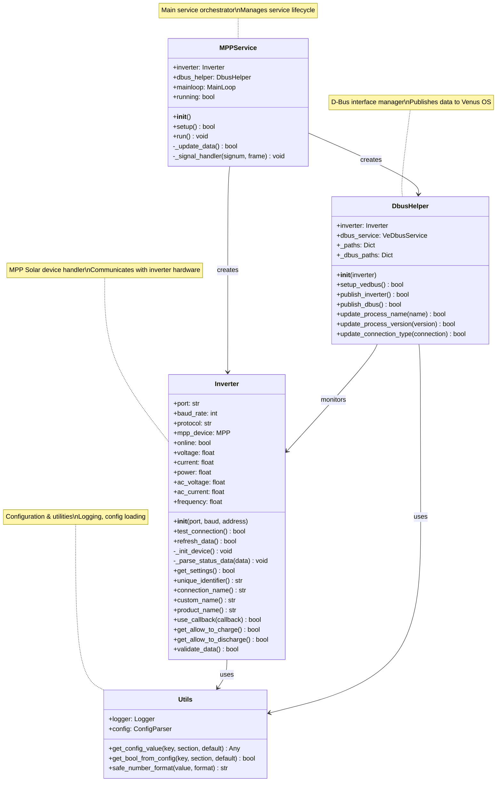
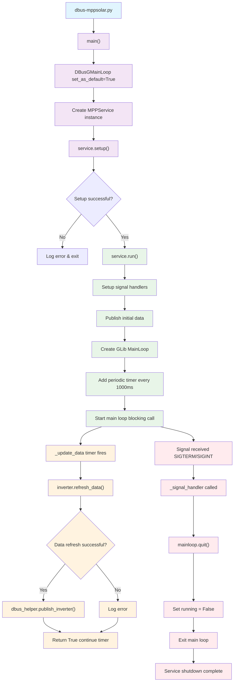
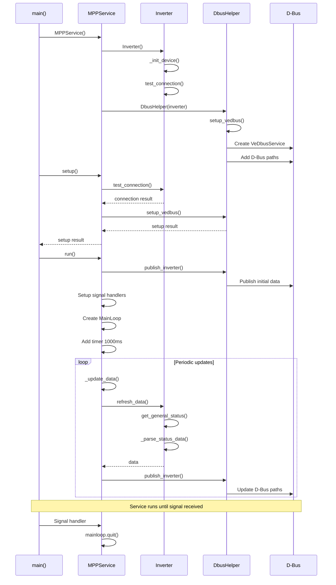
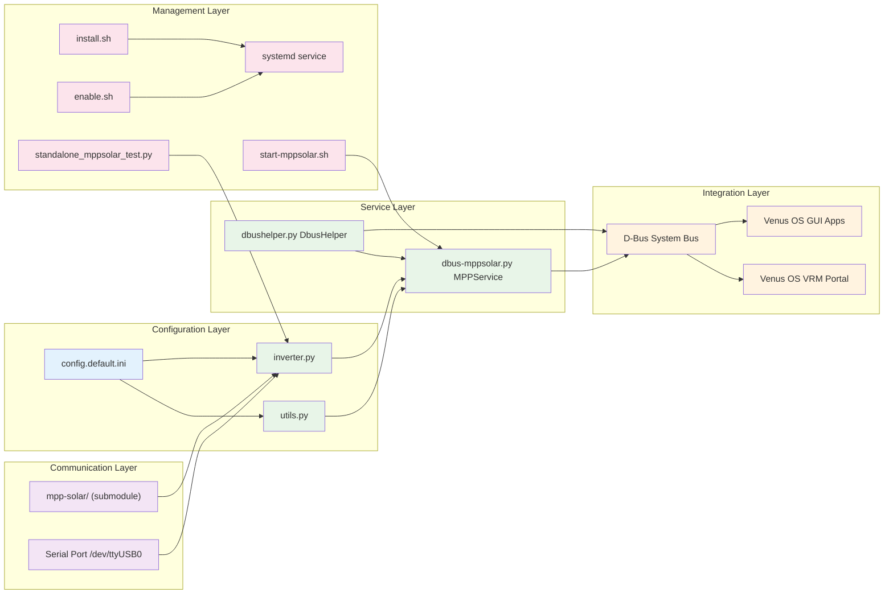

# dbus-mppsolar v2

## Venus OS D-Bus Service for MPP Solar Inverters with Multi/Solar Charger Architecture

**Version: 1.0.0** - Production-ready implementation with comprehensive MPP Solar data mapping.

This service implements a complete Venus OS D-Bus integration for MPP Solar inverters (PI30 series) using the [mpp-solar](https://github.com/jblance/mpp-solar) Python package. It features a proper Multi/Solar Charger service architecture that correctly represents hybrid inverter/charger functionality and provides comprehensive data mapping for all MPP Solar values.

## Key Features

- **Multi/Solar Charger Architecture**: Implements proper Victron D-Bus service types for hybrid inverters
- **Device Capability Detection**: Automatically assesses device capabilities and creates appropriate services
- **Comprehensive Data Mapping**: Maps all MPP Solar PI30 protocol values to appropriate D-Bus paths
- **Conditional Path Publishing**: Only publishes paths that are supported by the connected device
- **Enhanced Logging**: Extensive debug logging with configurable log levels and file rotation
- **Venus OS Integration**: Full compatibility with GX devices and Venus OS ecosystem
- **Private Bus Connections**: Uses private D-Bus connections to avoid conflicts with core services

## Architecture Overview

The service creates two D-Bus services based on device capabilities:

1. **Multi Service** (`com.victronenergy.multi.mppsolar`): Handles inverter/charger functionality
2. **Solar Charger Service** (`com.victronenergy.solarcharger.mppsolar`): Handles PV input data

This architecture correctly represents MPP Solar hybrid inverters that combine AC charging, DC solar input, and battery management in a single device.

## Implementation

This service integrates the following repositories:
- [dbus-serialbattery](https://github.com/mr-manuel/venus-os_dbus-serialbattery) - D-Bus patterns and Venus OS integration
- [mpp-solar](https://github.com/jblance/mpp-solar) - MPP Solar protocol implementation

**AI-generated code with human validation and testing by: Grok XAI and HHaufe (spacecabbie)**

## Current working features are:

- D-Bus integration with Venus OS
- Support for PI30 protocol inverters via USB/HIDRAW connections
- Comprehensive logging and error handling

### Testing

Run standalone tests with the new architecture:
```bash
cd /data/apps/dbus-mppsolarv2
python3 standalone_mppsolar_test.py
```

Expected output includes capability assessment and comprehensive data mapping:
```
Starting MPP Solar standalone test with Multi/Solar Charger architecture...
Testing MPP Solar inverter connection...
Using port: /dev/hidraw0, baud: 2400
✓ Connection successful
Testing device capability assessment...
✓ Capability assessment completed
Device Capabilities:
  has_ac_output: True
  has_ac_input: True
  has_battery_data: True
  has_pv_data: True
  has_temperature: True
  minimum_requirements_met: True
Testing data refresh and D-Bus mapping...
✓ Data refresh completed
MPP Solar Data Values:
  ac_voltage: 230.1
  ac_current: 2.3
  ...
D-Bus Path Mapping:
  /Ac/Out/L1/V: 230.1
  /Ac/In/L1/V: 240.5
  ...
✓ All tests passed!
```

#### Direct MPP Solar Communication testing

For direct communication with your MPP Solar inverter (useful for testing and debugging), use the provided wrapper script:

```bash
# Get device protocol info
./run-mpp-solar.sh -p /dev/hidraw0 -c QPI

# Get full inverter status
./run-mpp-solar.sh -p /dev/hidraw0 -c QPIGS

# Get device mode
./run-mpp-solar.sh -p /dev/hidraw0 -c QMOD

# With debug output
./run-mpp-solar.sh -p /dev/hidraw0 -c QPIGS -D

# List available commands for PI30 protocol
./run-mpp-solar.sh -P PI30 -c
```

**Note:** The `run-mpp-solar.sh` script is specifically designed for Venus OS to avoid Python package installation conflicts. It provides direct access to all mpp-solar functionality without requiring package installation.

## D-Bus Services and Paths

The service creates two D-Bus services based on device capabilities:

### Multi Service (`com.victronenergy.multi.mppsolar`)
Handles inverter/charger functionality with the following paths:

#### AC Input/Output
- `/Ac/In/L1/V` - AC input voltage (V)
- `/Ac/In/L1/I` - AC input current (A)
- `/Ac/In/L1/F` - AC input frequency (Hz)
- `/Ac/Out/L1/V` - AC output voltage (V)
- `/Ac/Out/L1/I` - AC output current (A)
- `/Ac/Out/L1/P` - AC output active power (W)
- `/Ac/Out/L1/S` - AC output apparent power (VA)
- `/Ac/Out/L1/F` - AC output frequency (Hz)

#### Battery Data
- `/Dc/Battery/Voltage` - Battery voltage (V)
- `/Dc/Battery/Current` - Battery current (A, negative for discharge)
- `/Dc/Battery/Power` - Battery power (W)
- `/Dc/Battery/Soc` - Battery state of charge (%)
- `/Dc/Battery/Temperature` - Battery temperature (°C)

#### System Status
- `/Mode` - Operating mode (1=Charger, 2=Inverter, 3=Off, 4=System fault)
- `/State` - System state (0=Off, 1=Low Power, 2=Fault, 9=Inverting)
- `/ErrorCode` - Error code (0=None, 1=Device fault, 2=AC input fault, etc.)
- `/Relay/0/State` - Relay state (0=Open, 1=Closed)

#### Device Information
- `/DeviceInstance` - Device instance ID
- `/ProductId` - Product ID (0xB004)
- `/ProductName` - Product name ("MPP Solar Multi")
- `/FirmwareVersion` - Firmware version
- `/Serial` - Device serial number

#### Management
- `/Mgmt/ProcessName` - Process name ("dbus-mppsolar")
- `/Mgmt/ProcessVersion` - Process version ("1.0.0")
- `/Mgmt/Connection` - Connection type ("USB HID", "Serial USB", etc.)
- `/Connected` - Connection status (0/1)

### Solar Charger Service (`com.victronenergy.solarcharger.mppsolar`)
Handles PV input data with the following paths:

#### PV Input
- `/Dc/0/Voltage` - PV input voltage (V)
- `/Dc/0/Current` - PV input current (A)
- `/Dc/0/Power` - PV input power (W)

#### System Data
- `/Dc/0/Temperature` - PV controller temperature (°C)
- `/Load/State` - Load state (0=Off, 1=On)
- `/Yield/Power` - Daily yield power (W)
- `/Yield/User` - Total user yield (kWh)
- `/Yield/System` - Total system yield (kWh)

#### Status
- `/State` - Charger state (0=Off, 1=Low Power, 2=Fault, 3=Bulk, 4=Absorption, 5=Float, 6=Storage, 7=Equalize, 8=Passthru, 9=Inverting, 11=Power supply, 252=External control)
- `/ErrorCode` - Error code (0=None, 1=Battery voltage too high, 2=Battery voltage too low, etc.)
- `/OffReason` - Off reason bitmask

#### Device Information
- `/ProductId` - Product ID (0xA06C)
- `/ProductName` - Product name ("MPP Solar Solar Charger")
- `/FirmwareVersion` - Firmware version
- `/Serial` - Device serial number

#### Management
- `/Mgmt/ProcessName` - Process name ("dbus-mppsolar")
- `/Mgmt/ProcessVersion` - Process version ("1.0.0")
- `/Mgmt/Connection` - Connection type
- `/Connected` - Connection status (0/1)

### Custom MPP Solar Paths
Additional device-specific data is published under custom paths:

#### Multi Service Custom Paths
- `/Custom/MppSolar/AcLoadPercentage` - AC load percentage (%)
- `/Custom/MppSolar/BusVoltage` - Bus voltage (V)
- `/Custom/MppSolar/HeatSinkTemp` - Heat sink temperature (°C)
- `/Custom/MppSolar/IsChargingOn` - Charging enabled status
- `/Custom/MppSolar/IsSccChargingOn` - SCC charging enabled status
- `/Custom/MppSolar/IsChargingToFloat` - Float charging status

#### Solar Charger Service Custom Paths
- `/Custom/MppSolar/PvInputCurrentBattery` - PV input current for battery (A)
- `/Custom/MppSolar/PvInputPower` - PV input power (W)

### Conditional Path Publishing

Paths are only published if the device supports the corresponding functionality:
- AC input paths only if AC input voltage > 1.0V is detected
- Battery paths only if battery voltage is available
- PV paths only if PV voltage or power is available
- Temperature paths only if temperature data is valid (0-100°C)

This ensures clean D-Bus interfaces without placeholder values.

## Troubleshooting

### Common Issues

**1. Device Not Found**
```bash
# Check available serial devices
ls /dev/ttyUSB* /dev/ttyACM* /dev/ttyS* /dev/hidraw*

# Check device permissions
ls -la /dev/hidraw0

# Check recent device connections
dmesg | grep -E "(tty|hidraw|usb)" | tail -10

# Fix permissions if needed
sudo chmod 666 /dev/hidraw0
```

**2. Connection Timeout**
- Verify correct port in `config.ini`
- Check baud rate (typically 2400 for MPP Solar)
- Ensure device is powered on and connected
- Try different USB port or cable

**3. D-Bus Service Conflicts**
- Service uses private bus connections to avoid conflicts
- Check for existing MPP Solar services: `systemctl list-units | grep mppsolar`
- Stop conflicting services before starting this one

**4. No Data in Venus OS GUI**
- Verify D-Bus paths are published: `dbus -y com.victronenergy.multi.mppsolar /Connected GetValue`
- Check service logs for data publishing errors
- Ensure device capabilities match expected data

### Debug Mode

Enable detailed logging for troubleshooting:

```ini
# In config.ini
[DBUS]
DEBUG_ENABLED = True

[LOGGING]
LOG_LEVEL = DEBUG
```

### Service Logs

```bash
# View recent logs
journalctl -u com.victronenergy.mppsolar.service -n 50

# Follow logs in real-time
journalctl -u com.victronenergy.mppsolar.service -f

# View logs with timestamps
journalctl -u com.victronenergy.mppsolar.service --since "1 hour ago"
```

### Manual Testing

```bash
# Test device connection only
python3 standalone_mppsolar_test.py

# Run service in foreground for debugging
python3 dbus-mppsolar.py

# Test direct MPP Solar communication
./run-mpp-solar.sh -p /dev/hidraw0 -c QPIGS
```

### Performance Issues

- **High CPU usage**: Increase poll interval in config (default 1000ms)
- **Serial communication errors**: Check USB cable quality and power supply
- **Log file growing too large**: Adjust log rotation settings in config

### Recovery Steps

1. **Stop the service**: `systemctl stop com.victronenergy.mppsolar.service`
2. **Check device connection**: `ls -la /dev/hidraw*`
3. **Test standalone**: `python3 standalone_mppsolar_test.py`
4. **Check configuration**: Verify `config.ini` settings
5. **Restart service**: `systemctl restart com.victronenergy.mppsolar.service`
6. **Monitor logs**: `journalctl -u com.victronenergy.mppsolar.service -f`

```
dbus-mppsolarv2/
├── README.md                           # 📖 Project documentation and installation guide
├── pyproject.toml                      # ⚙️ Python project configuration with dependencies
├── dbus-mppsolar.py                    # 🚀 Main D-Bus service entry point and main loop
├── standalone_mppsolar_test.py         # 🧪 Standalone testing script for device connection
├── mpp-solar/                          # 📦 MPP Solar communication library (git submodule)
├── dbus_mppsolar/                      # 📁 Core service modules directory
│   ├── __init__.py                     # 🐍 Python package initialization
│   ├── inverter.py                     # � MPP Solar inverter device implementation
│   ├── dbushelper.py                   # 🔌 D-Bus communication helper for Venus OS
│   ├── utils.py                        # 🛠️ Configuration management and utility functions
│   ├── config.default.ini              # ⚙️ Default configuration template
│   ├── config.ini                      # ⚙️ User configuration file (created from default)
│   └── dbus-mppsolar.py                # 🔄 Alternative service entry point
├── service/                            # 🔧 Systemd service configuration
│   └── com.victronenergy.mppsolar.service # 📋 Systemd service definition file
├── test/                               # 🧪 Testing directory
│   └── README.md                       # 📋 Test documentation and usage instructions
├── .github/                            # 🔧 GitHub repository configuration
│   └── copilot-instructions.md         # 🤖 AI assistant instructions for development
├── *.sh                                # 📜 Shell scripts for service management
│   ├── install.sh                      # 📦 Automated installation script
│   ├── uninstall.sh                    # 🗑️ Service removal script
│   ├── enable.sh                       # ✅ Enable systemd service
│   ├── disable.sh                      # ❌ Disable systemd service
│   ├── restart.sh                      # 🔄 Restart service script
│   ├── start-mppsolar.sh               # ▶️ Manual service start script
│   └── run-mpp-solar.sh                # 🔧 Direct MPP Solar communication wrapper
├── bms/                                # 🔋 Empty directory (reserved for future BMS drivers)
├── ext/                                # 📦 Empty directory (reserved for external dependencies)
├── qml/                                # 🎨 Empty directory (reserved for QML UI components)
└── rc/                                 # 🔧 Empty directory (reserved for runtime configuration)
```

### 📁 Directory and File Details

#### **Root Level Files**
- **`README.md`** - Comprehensive project documentation including installation, configuration, usage, and troubleshooting
- **`pyproject.toml`** - Python project configuration defining dependencies (mpp-solar, pyserial, dbus-python, gobject)
- **`dbus-mppsolar.py`** - Main service entry point that initializes D-Bus, sets up the MPPService, and runs the main event loop
- **`standalone_mppsolar_test.py`** - Independent testing script to verify MPP Solar device connection and data retrieval

#### **MPP Solar Library (`mpp-solar/`)**  
- **`mpp-solar/`** - Git submodule containing the MPP Solar communication library for inverter protocol handling

#### **Core Service Directory (`dbus_mppsolar/`)**  
- **`__init__.py`** - Python package initialization file
- **`inverter.py`** - Implements the Inverter class that handles MPP Solar inverter communication using the mpp-solar package
- **`dbushelper.py`** - D-Bus helper class that publishes inverter data to Venus OS D-Bus paths for system integration  
- **`utils.py`** - Utility functions for configuration loading, logging setup, and Venus OS constants
- **`config.default.ini`** - Template configuration file with default settings for port, baud rate, protocol, and timeouts
- **`config.ini`** - User configuration file (created from config.default.ini during installation)
- **`dbus-mppsolar.py`** - Alternative service entry point (may be redundant with root level file)

#### **Service Configuration (`service/`)**  
- **`com.victronenergy.mppsolar.service`** - Systemd service definition for automatic startup and management

#### **Testing (`test/`)**  
- **`README.md`** - Documentation for testing procedures and expected results

#### **GitHub Configuration (`.github/`)**  
- **`copilot-instructions.md`** - Instructions for AI assistants on project development guidelines and workflow

#### **Management Scripts (`*.sh`)**  
- **`install.sh`** - Automated installation script that sets up dependencies, copies files, and configures systemd
- **`uninstall.sh`** - Removes the service, cleans up files, and disables systemd service  
- **`enable.sh`** - Enables the systemd service for automatic startup
- **`disable.sh`** - Disables the systemd service
- **`restart.sh`** - Restarts the running service
- **`start-mppsolar.sh`** - Manual service startup script
- **`run-mpp-solar.sh`** - Direct MPP Solar communication wrapper (Venus OS compatible)

#### **Reserved Directories**  
- **`bms/`** - Empty directory reserved for future BMS (Battery Management System) driver implementations
- **`ext/`** - Empty directory for external dependencies and libraries  
- **`qml/`** - Empty directory for QML user interface components (if GUI development is added)
- **`rc/`** - Empty directory for runtime configuration scripts and hooks## License

MIT License - see LICENSE file for details

## Contributing

1. Fork the repository
2. Create a feature branch
3. Make your changes
4. Add tests if applicable
5. Submit a pull request

## Code Architecture & Flow Diagrams

### 🏗️ Class Diagram



### 🔄 Execution Flow Diagram



### 📊 Sequence Diagram



### 🔧 Data Flow & Dependencies



### 📋 Component Relationships Explained

#### **Class Relationships:**
- **MPPService** → **Inverter**: Creates and manages the inverter instance
- **MPPService** → **DbusHelper**: Creates and manages the D-Bus interface
- **Inverter** → **Utils**: Uses logging and configuration utilities
- **DbusHelper** → **Utils**: Uses logging and D-Bus constants
- **DbusHelper** → **Inverter**: Monitors inverter data for publishing

#### **Execution Flow:**
1. **Entry Point**: `dbus-mppsolar.py:main()` initializes D-Bus and creates service
2. **Setup Phase**: Service initializes inverter connection and D-Bus interface
3. **Runtime Phase**: Main loop runs with periodic data updates every 1 second
4. **Data Flow**: Inverter → MPPService → DbusHelper → D-Bus → Venus OS
5. **Shutdown**: Signal handlers gracefully stop the service

#### **Key Data Paths:**
- **AC Data**: `ac_voltage`, `ac_current`, `ac_power`, `frequency`
- **DC Data**: Not published (to avoid double-counting with AC power in Venus OS)
- **Battery Service**: Separate `com.victronenergy.battery.mppsolar_{instance}` service with voltage, current, power, SOC
- **Status**: `online`, `connection_info`
- **D-Bus Paths**: `/Ac/Out/L1/*`, `/Dc/0/*`, `/Connected`, `/Status`, `/State`


This architecture provides a clean separation between device communication, data processing, and system integration, making it maintainable and extensible for Venus OS compatibility.

