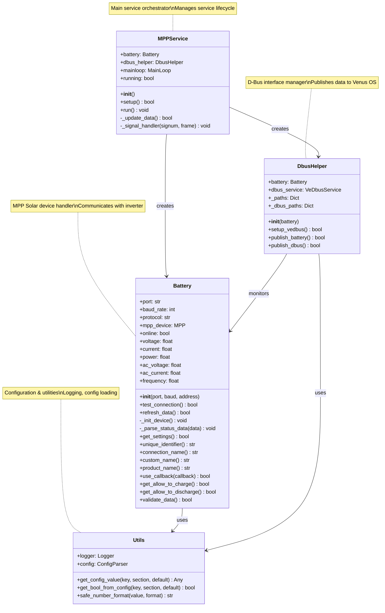
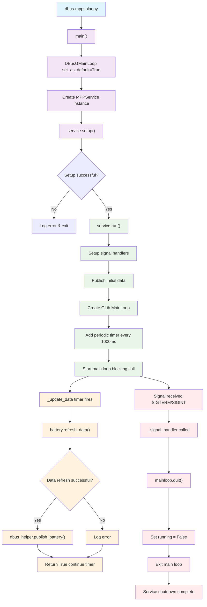
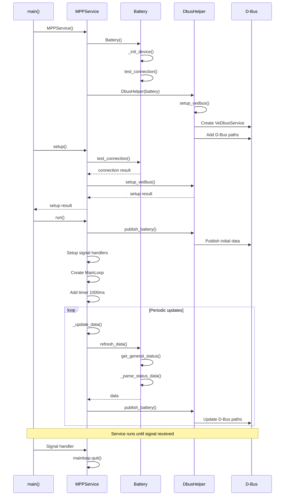

# dbus-mppsolar

Venus OS D-Bus service for MPP Solar inverters, specifically designed for PI30 models.

This service adapts the [dbus-serialbattery](https://github.com/mr-manuel/venus-os_dbus-serialbattery) codebase to work with MPP Solar inverters using the [mpp-solar](https://github.com/jblance/mpp-solar) Python package.

## Disclaimer

**Initial code conversion via Grok xAI**  
**Modifications and Testing by: HHaufe (spacecabbie)**

## Features

- D-Bus integration with Venus OS
- Support for PI30 inverters via serial and USB/HIDRAW connections
- Real-time monitoring and control
- Automatic inverter detection and configuration
- Comprehensive logging and error handling

## Requirements

- Venus OS (or compatible Linux system with D-Bus)
- Python 3.7+
- MPP Solar inverter (PI30 series)
- Serial or USB connection to inverter

## Installation

### Automatic Installation (Recommended)

1. SSH into your Venus OS device and clone the repository:
   ```bash
   ssh root@venus-device
   mkdir -p /data/etc
   cd /data/etc
   git clone https://github.com/spacecabbie/dbus-mppsolarv2.git dbus-mppsolarv2
   cd dbus-mppsolarv2
   ```

2. Run the installation script:
   ```bash
   ./install.sh
   ```

### Manual Installation

1. Install Python dependencies:
   ```bash
   pip3 install mpp-solar pyserial dbus-python gobject
   ```

2. Copy service file:
   ```bash
   cp service/com.victronenergy.mppsolar.service /etc/systemd/system/
   ```

3. Reload systemd and enable service:
   ```bash
   systemctl daemon-reload
   systemctl enable com.victronenergy.mppsolar.service
   systemctl start com.victronenergy.mppsolar.service
   ```

## Configuration

1. Copy the default configuration:
   ```bash
   cp config.default.ini config.ini
   ```

2. Edit `config.ini` with your inverter settings:
   - `PORT`: Serial port (e.g., `/dev/ttyUSB0`) or USB device path
   - `BAUD_RATE`: Communication baud rate (default: 2400)
   - `PROTOCOL`: MPP Solar protocol version (default: PI30)
   - `TIMEOUT`: Connection timeout in seconds

## Usage

### Starting the Service

```bash
# Using systemd
systemctl start com.victronenergy.mppsolar.service

# Or run manually
./start-mppsolar.sh
```

### Monitoring

Check service status:
```bash
systemctl status com.victronenergy.mppsolar.service
```

View logs:
```bash
journalctl -u com.victronenergy.mppsolar.service -f
```

### Testing

Run standalone tests:
```bash
python3 test/standalone_mppsolar_test.py
```

## D-Bus Paths

The service publishes the following D-Bus paths:

- `/Ac/Out/L1/V` - AC output voltage
- `/Ac/Out/L1/I` - AC output current
- `/Ac/Out/L1/P` - AC output power
- `/Ac/Out/L1/F` - AC frequency
- `/Dc/0/Voltage` - DC input voltage
- `/Dc/0/Current` - DC input current
- `/Dc/0/Power` - DC input power
- `/DeviceInstance` - Device instance ID (dynamically assigned)
- `/ProductId` - Product ID
- `/ProductName` - Product name
- `/FirmwareVersion` - Firmware version
- `/Connected` - Connection status (0/1)
- `/Status` - Service status (0=Offline, 1=Running)
- `/Mgmt/ProcessName` - Process name (dbus-mppsolar)
- `/Mgmt/ProcessVersion` - Process version (1.0.0)
- `/Mgmt/Connection` - Connection type (Serial USB)

## Troubleshooting

### Common Issues

1. **Connection Failed**
   - Check USB/serial cable connection
   - Verify inverter is powered on
   - Check port permissions: `ls -la /dev/ttyUSB*`

2. **D-Bus Errors**
   - Ensure D-Bus is running: `systemctl status dbus`
   - Check service permissions

3. **Import Errors**
   - Install missing dependencies: `pip3 install mpp-solar pyserial dbus-python gobject`

### Logs

Check service logs:
```bash
journalctl -u com.victronenergy.mppsolar.service -n 50
```

## Deployment on Venus OS

### Prerequisites

- Venus OS device (Cerbo GX, CCGX, etc.) with SSH access
- MPP Solar inverter (PI30 series) connected via USB or serial
- Internet connection for package installation

### Access Methods

#### Direct SSH Access
```bash
ssh root@venus-device-ip
# Default password: (check device label or use VictronConnect)
```

#### Via Venus OS Large (if available)
```bash
# Connect to Venus OS Large and use terminal
```

### Installation

#### Method 1: Git Clone (Recommended)

1. **Clone the repository on your Venus OS device:**
   ```bash
   ssh root@venus-device
   mkdir -p /data/etc
   cd /data/etc
   git clone https://github.com/spacecabbie/dbus-mppsolarv2.git dbus-mppsolarv2
   cd dbus-mppsolarv2
   ```

2. **Initialize and update the mpp-solar submodule:**
   ```bash
   git submodule update --init --recursive
   ```

3. **Run the installation script:**
   ```bash
   ./install.sh
   ```

3. **Verify installation:**
   ```bash
   systemctl status com.victronenergy.mppsolar.service
   ```

#### Method 2: Manual Download

1. **Download and extract on Venus OS:**
   ```bash
   ssh root@venus-device
   mkdir -p /data/etc
   cd /data/etc
   wget https://github.com/spacecabbie/dbus-mppsolarv2/archive/master.zip
   unzip master.zip
   mv dbus-mppsolarv2-master dbus-mppsolarv2
   cd dbus-mppsolarv2
   ```

2. **Initialize the mpp-solar submodule:**
   ```bash
   git submodule update --init --recursive
   ```

3. **Run the installation script:**
   ```bash
   ./install.sh
   ```

#### Method 3: SCP Transfer (Alternative)

1. **Transfer the service files to Venus OS:**
   ```bash
   # From your local machine (if you have the files locally)
   scp -r dbus-mppsolar root@venus-device:/data/etc/dbus-mppsolarv2
   ```

2. **Connect to Venus OS and initialize submodule:**
   ```bash
   ssh root@venus-device
   cd /data/etc/dbus-mppsolarv2
   git submodule update --init --recursive
   ```

3. **Run the installation script:**
   ```bash
   ./install.sh
   ```

### Configuration

Edit `/data/etc/dbus-mppsolarv2/config.ini`:

```ini
[MPPSOLAR]
PORT = /dev/ttyUSB0          # Serial port (check with ls /dev/ttyUSB*)
BAUD_RATE = 2400            # Communication baud rate
PROTOCOL = PI30             # MPP Solar protocol
TIMEOUT = 5                 # Connection timeout in seconds
```

**Find the correct serial port:**
```bash
ls /dev/ttyUSB* /dev/ttyACM* /dev/ttyS*
dmesg | grep tty  # Check recent serial device connections
```

### Testing

#### 1. Standalone Connection Test

Test the MPP Solar device connection independently:

```bash
cd /data/etc/dbus-mppsolarv2
python3 standalone_mppsolar_test.py
```

Expected output:
```
MPP Solar Device Test
=====================
Port: /dev/ttyUSB0
Baud Rate: 2400
Protocol: PI30

Testing connection...
✓ Connection successful!
Device Info: {...}
Status Data: {...}
```

#### 2. Service Status Check

```bash
# Check if service is running
systemctl status com.victronenergy.mppsolar.service

# View service logs
journalctl -u com.victronenergy.mppsolar.service -f

# Restart service
systemctl restart com.victronenergy.mppsolar.service
```

#### 3. D-Bus Path Verification

Check if D-Bus paths are published correctly:

```bash
# List all D-Bus services
dbus -y com.victronenergy.inverter /DeviceInstance GetValue

# Check specific paths
dbus -y com.victronenergy.inverter /Ac/Out/L1/V GetValue
dbus -y com.victronenergy.inverter /Connected GetValue
dbus -y com.victronenergy.inverter /ProductName GetValue
```

#### 4. Venus OS GUI Verification

1. **Via VictronConnect:**
   - Connect to your Venus OS device
   - Check if the MPP Solar inverter appears in the device list
   - Verify data is updating in real-time

2. **Via VRM Portal:**
   - Access https://vrm.victronenergy.com
   - Check if inverter data appears in the dashboard
   - Verify historical data logging

3. **Via Venus OS Web Interface:**
   - Access the device web interface
   - Check Settings → System Setup → Device List
   - Verify inverter appears with correct device instance

### Troubleshooting

#### Common Issues

1. **Service won't start:**
   ```bash
   # Check service status and logs
   systemctl status com.victronenergy.mppsolar.service
   journalctl -u com.victronenergy.mppsolar.service -n 50
   
   # Check for Python errors
   python3 -c "import mpp-solar; print('MPP Solar OK')"
   ```

2. **Connection failed:**
   ```bash
   # Check serial port permissions
   ls -la /dev/ttyUSB0
   
   # Test serial connection manually
   python3 -c "
   import serial
   ser = serial.Serial('/dev/ttyUSB0', 2400, timeout=1)
   print('Serial port OK')
   ser.close()
   "
   ```

3. **D-Bus errors:**
   ```bash
   # Check D-Bus is running
   systemctl status dbus
   
   # List D-Bus services
   dbus-send --system --dest=org.freedesktop.DBus --type=method_call --print-reply /org/freedesktop/DBus org.freedesktop.DBus.ListNames
   ```

4. **Device not appearing in GUI:**
   ```bash
   # Check device instance
   dbus -y com.victronenergy.inverter /DeviceInstance GetValue
   
   # Restart GUI services
   systemctl restart venus-gui
   ```

#### Debug Mode

Enable debug logging by modifying the service:

```bash
# Edit service file
nano /etc/systemd/system/com.victronenergy.mppsolar.service

# Add to ExecStart:
# --log-level DEBUG

# Reload and restart
systemctl daemon-reload
systemctl restart com.victronenergy.mppsolar.service
```

#### Log Analysis

```bash
# Follow logs in real-time
journalctl -u com.victronenergy.mppsolar.service -f

# Search for specific errors
journalctl -u com.victronenergy.mppsolar.service | grep ERROR

# Check system logs for serial issues
dmesg | grep tty
```

### Performance Monitoring

Monitor the service performance:

```bash
# CPU and memory usage
ps aux | grep dbus-mppsolar

# D-Bus activity
dbus-monitor --system "type='signal',sender='com.victronenergy.inverter'"

# System resource usage
top -p $(pgrep -f dbus-mppsolar)
```

### Backup and Recovery

```bash
# Backup configuration
cp /data/etc/dbus-mppsolarv2/config.ini /data/etc/dbus-mppsolarv2/config.ini.backup

# Full service backup
tar -czf dbus-mppsolarv2-backup.tar.gz /data/etc/dbus-mppsolarv2/

# Restore from backup
tar -xzf dbus-mppsolarv2-backup.tar.gz -C /
systemctl restart com.victronenergy.mppsolar.service
```

### Updating the Service

#### Method 1: Git Update (Recommended)

```bash
# Stop service
systemctl stop com.victronenergy.mppsolar.service

# Update from repository
cd /data/etc/dbus-mppsolarv2
git pull origin master
git submodule update --init --recursive

# Restart service
systemctl start com.victronenergy.mppsolar.service
```

#### Method 2: Manual Update

```bash
# Stop service
systemctl stop com.victronenergy.mppsolar.service

# Backup current version
mv /data/etc/dbus-mppsolarv2 /data/etc/dbus-mppsolarv2.old

# Install new version
# (transfer and install as described above)

# Initialize submodule
git submodule update --init --recursive

# Restore configuration
cp /data/etc/dbus-mppsolarv2.old/config.ini /data/etc/dbus-mppsolarv2/

# Start service
systemctl start com.victronenergy.mppsolar.service
```

### Support

If you encounter issues:

1. Check the logs: `journalctl -u com.victronenergy.mppsolar.service -n 100`
2. Verify hardware connections and serial port
3. Test with standalone script: `python3 standalone_mppsolar_test.py`
4. Check Venus OS version compatibility
5. Report issues with full logs and configuration details

## Project Structure

```
dbus-mppsolarv2/
├── README.md                           # 📖 Project documentation and installation guide
├── pyproject.toml                      # ⚙️ Python project configuration with dependencies
├── dbus-mppsolar.py                    # 🚀 Main D-Bus service entry point and main loop
├── standalone_mppsolar_test.py         # 🧪 Standalone testing script for device connection
├── mpp-solar/                          # 📦 MPP Solar communication library (git submodule)
├── dbus-mppsolar/                      # 📁 Core service modules directory
│   ├── battery.py                      # 🔋 MPP Solar inverter device implementation
│   ├── dbushelper.py                   # 🔌 D-Bus communication helper for Venus OS
│   ├── utils.py                        # 🛠️ Configuration management and utility functions
│   ├── config.default.ini              # ⚙️ Default configuration template
│   └── dbus-mppsolar.py                # 🔄 Alternative service entry point (duplicate)
├── service/                            # 🔧 Systemd service configuration
│   └── com.victronenergy.mppsolar.service # 📋 Systemd service definition file
├── test/                               # 🧪 Testing directory
│   └── README.md                       # 📋 Test documentation and usage instructions
├── .github/                            # 🔧 GitHub repository configuration
│   └── copilot-instructions.md         # 🤖 AI assistant instructions for development
├── *.sh                                # 📜 Shell scripts for service management
│   ├── install.sh                      # 📦 Automated installation script
│   ├── uninstall.sh                    # 🗑️ Service removal script
│   ├── enable.sh                       # ✅ Enable systemd service
│   ├── disable.sh                      # ❌ Disable systemd service
│   ├── restart.sh                      # 🔄 Restart service script
│   └── start-mppsolar.sh               # ▶️ Manual service start script
├── bms/                                # 🔋 Empty directory (reserved for future BMS drivers)
├── ext/                                # 📦 Empty directory (reserved for external dependencies)
├── qml/                                # 🎨 Empty directory (reserved for QML UI components)
└── rc/                                 # 🔧 Empty directory (reserved for runtime configuration)
```

### 📁 Directory and File Details

#### **Root Level Files**
- **`README.md`** - Comprehensive project documentation including installation, configuration, usage, and troubleshooting
- **`pyproject.toml`** - Python project configuration defining dependencies (mpp-solar, pyserial, dbus-python, gobject)
- **`dbus-mppsolar.py`** - Main service entry point that initializes D-Bus, sets up the MPP service, and runs the main event loop
- **`standalone_mppsolar_test.py`** - Independent testing script to verify MPP Solar device connection and data retrieval

#### **MPP Solar Library (`mpp-solar/`)**
- **`mpp-solar/`** - Git submodule containing the MPP Solar communication library for inverter protocol handling

#### **Core Service Directory (`dbus-mppsolar/`)**
- **`battery.py`** - Implements the Battery class that handles MPP Solar inverter communication using the mpp-solar package
- **`dbushelper.py`** - D-Bus helper class that publishes inverter data to Venus OS D-Bus paths for system integration
- **`utils.py`** - Utility functions for configuration loading, logging setup, and Venus OS constants
- **`config.default.ini`** - Template configuration file with default settings for port, baud rate, protocol, and timeouts
- **`dbus-mppsolar.py`** - Alternative/duplicate service entry point (may be redundant)

#### **Service Configuration (`service/`)**
- **`com.victronenergy.mppsolar.service`** - Systemd service definition for automatic startup and management

#### **Testing (`test/`)**
- **`README.md`** - Documentation for testing procedures and expected results

#### **GitHub Configuration (`.github/`)**
- **`copilot-instructions.md`** - Instructions for AI assistants on project development guidelines and workflow

#### **Management Scripts (`*.sh`)**
- **`install.sh`** - Automated installation script that sets up dependencies, copies files, and configures systemd
- **`uninstall.sh`** - Removes the service, cleans up files, and disables systemd service
- **`enable.sh`** - Enables the systemd service for automatic startup
- **`disable.sh`** - Disables the systemd service
- **`restart.sh`** - Restarts the running service
- **`start-mppsolar.sh`** - Manual service startup script

#### **Reserved Directories**
- **`bms/`** - Empty directory reserved for future BMS (Battery Management System) driver implementations
- **`ext/`** - Empty directory for external dependencies and libraries
- **`qml/`** - Empty directory for QML user interface components (if GUI development is added)
- **`rc/`** - Empty directory for runtime configuration scripts and hooks

## License

MIT License - see LICENSE file for details

## Contributing

1. Fork the repository
2. Create a feature branch
3. Make your changes
4. Add tests if applicable
5. Submit a pull request

## Code Architecture & Flow Diagrams

### 🏗️ Class Diagram



### 🔄 Execution Flow Diagram



### 📊 Sequence Diagram



### 🔧 Data Flow & Dependencies


### 📋 Component Relationships Explained

#### **Class Relationships:**
- **MPPService** → **Battery**: Creates and manages the battery instance
- **MPPService** → **DbusHelper**: Creates and manages the D-Bus interface
- **Battery** → **Utils**: Uses logging and configuration utilities
- **DbusHelper** → **Utils**: Uses logging and D-Bus constants
- **DbusHelper** → **Battery**: Monitors battery data for publishing

#### **Execution Flow:**
1. **Entry Point**: `dbus-mppsolar.py:main()` initializes D-Bus and creates service
2. **Setup Phase**: Service initializes battery connection and D-Bus interface
3. **Runtime Phase**: Main loop runs with periodic data updates every 1 second
4. **Data Flow**: Battery → MPPService → DbusHelper → D-Bus → Venus OS
5. **Shutdown**: Signal handlers gracefully stop the service

#### **Key Data Paths:**
- **AC Data**: `ac_voltage`, `ac_current`, `ac_power`, `frequency`
- **DC Data**: `voltage`, `current`, `power` (mapped from AC for compatibility)
- **Status**: `online`, `connection_info`, `soc`, `capacity`
- **D-Bus Paths**: `/Ac/Out/L1/*`, `/Dc/0/*`, `/Connected`, `/Status`

This architecture provides a clean separation between device communication, data processing, and system integration, making it maintainable and extensible for Venus OS compatibility.